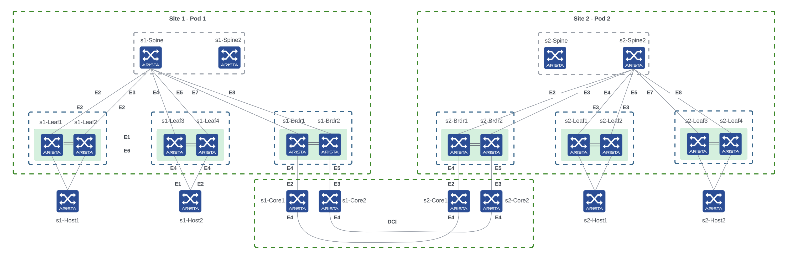
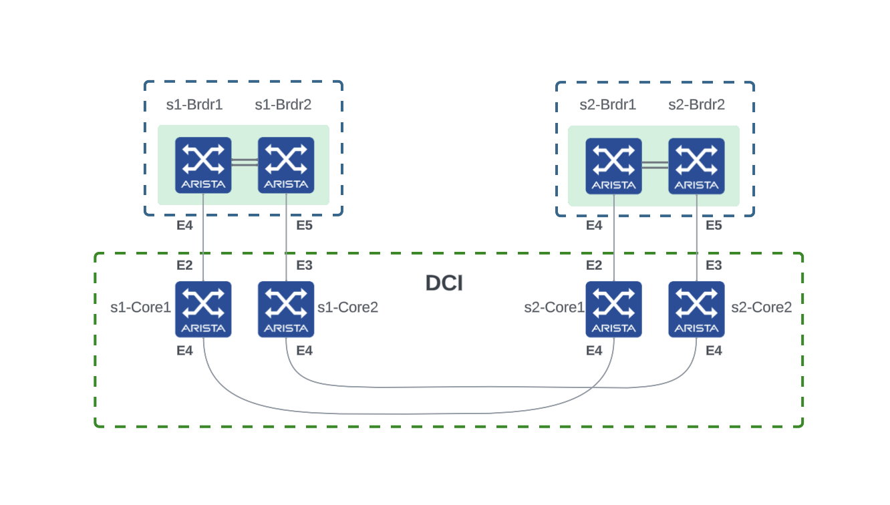

# Automation Transfer of Information

This TOI will walk you through the different steps to automate the creation of a VXLAN-EVPN fabric composed of 2 pods that will share a common underlay and a single EVPN domain as well as the EVPN services and host attachments.

We will use two approaches to achieve the same goal: Arista CloudVision Studios and Arista Validated Design.

A pod is a set of spines and the leafs connecting each other.
The 2 pods are interconnected with one link between `s1-brdr1` and `s2-brdr1` and another link between `s1-brdr2` and `s2-brdr2`.

## Table of contents

- [CloudVision Studios](studios)
  - [Lab 1: Staging](studios/1-staging.md)
  - [Lab 2: Create 2 VXLAN-EVPN pods](studios/2-create-pods.md)
  - [Lab 3: Configure the border leafs to extend the underlay and EVPN domain](studios/3-border-leafs.md)
  - [Lab 4: Create EVPN services and configure leaf server ports](studios/4-services-attachments.md)
- [Arista Validated Design](avd)
  - [Lab 1: Provision POD1](avd/1-provision-pod1.md)
  - [Lab 2: Provision POD2](avd/2-provision-pod2.md)
  - [Lab 3: Configure the border leafs to extend the underlay and EVPN domain](avd/3-border-leafs.md)
  - [Lab 4: Create EVPN services and configure leaf server ports](avd/4-services-attachments.md)