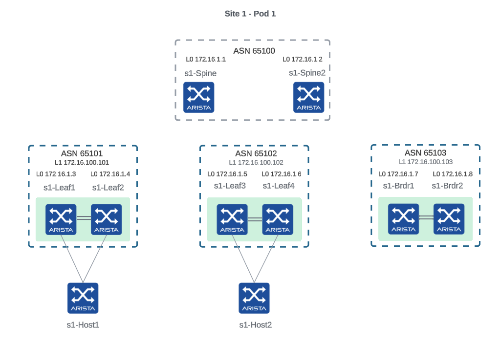

# Lab 1: Provision POD1

### Description

In this lab, we will use Arista Validated Design (AVD) to generate `POD1` underlay and overlay configuration and CloudVision to deploy it.
This is meant to be a first contact with AVD, no `eos_designs` variables or `eos_cli_config_gen` variables to create.
At the end of this lab, `POD1` will be a single EVPN domain.

This lab is refering to the AVD project versioned [here](https://github.com/arista-netdevops-community/avd-toi)

<p align="center">

</p>

### Instructions

1. Go to the folder `/home/coder/project/persist/avd-toi`.
2. Open `inventory.yml` and replace the `FILL ME` placeholders with your Arista Test Drive password.
3. Observe the inventory and how the Ansible groups are defiined:
   - The `type` variables are `eos_designs` variables documented [here](https://avd.sh/en/stable/roles/eos_designs/docs/input-variables.html#l3ls-evpn)
   - Pay attention to the `NETWORK_SERVICES` and `CONNECTED_ENDPOINTS` groups: you could create the file `group_vars/NETWORK_SERVICES.yml` and defined variables for all the children.
4. Open `group_vars/FABRIC.yml`. This file defines the global variables (for all pods) of the default [AVD design type](https://avd.sh/en/stable/roles/eos_designs/docs/input-variables.html#design-type) L3LS EVPN. This defines global design rules like default uplinks and downlinks that could be customized on specific pods, platforms settings...
5. Open `group_vars/POD1.yml`. This file defines the specific `eos_designs` variables for `POD1`. The `POD1` devices are defined by the `POD1` Ansible group and required variables must be defined here. BGP AS Numbers, IP Pools, Device IDs and MLAG specific configuration are defined here.
6. Open, read and run the playbook `build.yml` with the command `ansible-playbook build.yml`.
7. The folders `intended` and `documentation` have been created. Open the `documentation` folder and explore what has been generated.
8. The `intended/structured_configs` folder is the output of the `eos_designs` role. It takes high-level abstracted `eos_designs` variable and derives the `eos_cli_config_gen` structured configuration. The `eos_cli_config_gen` role then takes the `intended/structured_configs` folder as input and generate the folder `intended/configs` which will be used to create individual configlets for all devices in CloudVision.
9. Open, read and run the playbook `deploy.yml` with the command `ansible-playbook deploy.yml`.
10. Go to the CloudVision instance or your Arista Test Drive lab and open the `Provisioning` menu.
11. Go to the `Tasks` tab, select the tasks that have been created by the playbook and create a change control. At this point, you can select the Parallel arrangement to have the tasks executed in parallel within the change control.
12. You will be taken to the `Change Control` tab in the newly created change control. You can rename the `Change Control` to give it a meaningful name. Review, Approve and Execute the change control.
13. When the change control is completed, underlay and overlay of `POD1` will be configured. You can eventually access the devices via SSH and run the `show running-config` command to verify the configuration.
14. Connect to a spine and check the underlay and EVPN BGP sessions:
   ```cli
   s1-spine1#show ip bgp summary
   BGP summary information for VRF default
   Router identifier 172.16.1.1, local AS number 65100
   Neighbor Status Codes: m - Under maintenance
   Description              Neighbor  V AS           MsgRcvd   MsgSent  InQ OutQ  Up/Down State   PfxRcd PfxAcc
   s1-leaf1_Ethernet2       10.0.0.1  4 65101             10        11    0    0 00:01:25 Estab   3      3
   s1-leaf2_Ethernet2       10.0.0.5  4 65101             13        11    0    0 00:01:25 Estab   3      3
   s1-leaf3_Ethernet2       10.0.0.9  4 65102              9        12    0    0 00:01:25 Estab   3      3
   s1-leaf4_Ethernet2       10.0.0.13 4 65102             10        11    0    0 00:01:24 Estab   3      3
   s1-brdr1_Ethernet2       10.0.0.17 4 65103             10        11    0    0 00:01:24 Estab   3      3
   s1-brdr2_Ethernet2       10.0.0.21 4 65103             10        11    0    0 00:01:24 Estab   3      3
   s1-spine1#show bgp evpn summary
   BGP summary information for VRF default
   Router identifier 172.16.1.1, local AS number 65100
   Neighbor Status Codes: m - Under maintenance
   Description              Neighbor   V AS           MsgRcvd   MsgSent  InQ OutQ  Up/Down State   PfxRcd PfxAcc
   s1-leaf1                 172.16.0.1 4 65101              5         5    0    0 00:01:29 Estab   0      0
   s1-leaf2                 172.16.0.2 4 65101              5         5    0    0 00:01:29 Estab   0      0
   s1-leaf3                 172.16.0.3 4 65102              5         5    0    0 00:01:30 Estab   0      0
   s1-leaf4                 172.16.0.4 4 65102              5         5    0    0 00:01:25 Estab   0      0
   s1-brdr1                 172.16.0.5 4 65103              5         5    0    0 00:01:29 Estab   0      0
   s1-brdr2                 172.16.0.6 4 65103              5         5    0    0 00:01:29 Estab   0      0
   s1-spine1#
   ```