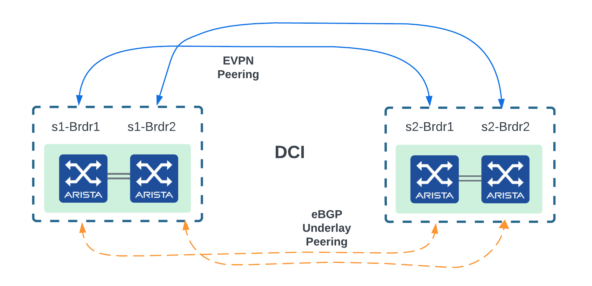
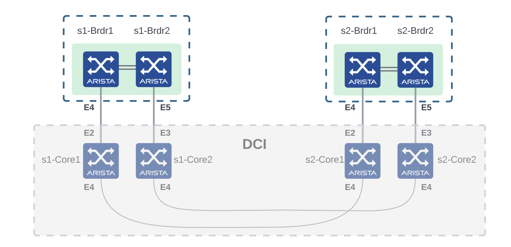

# Lab 3: Configure the border leafs to extend the underlay and EVPN domain

### Description

In this lab, we will configure Layer 3 point-to-point links between `s1-brdr1` and `s2-brdr1` and between `s1-brdr2` and `s2-brdr2`, create underlay eBGP sessions on these links and EVPN overlay sessions to extend the EVPN domains.
At the end of this lab, `POD1` and `POD2` will share the same underlay and form a single EVPN domain: all `Loopback0` interfaces must be reachable from any leafs.

<p align="center">

</p>

<p align="center">

</p>

### Instructions

1. Connect first to a border leaf and check the underlay and EVPN BGP sessions:   
    ```cli
    s1-brdr2#show ip bgp summary
    BGP summary information for VRF default
    Router identifier 172.16.0.6, local AS number 65103
    Neighbor Status Codes: m - Under maintenance
    Description              Neighbor    V AS           MsgRcvd   MsgSent  InQ OutQ  Up/Down State   PfxRcd PfxAcc
    s1-spine1_Ethernet8      10.0.0.20   4 65100             22        21    0    0 00:10:33 Estab   7      7
    s1-spine2_Ethernet8      10.0.0.22   4 65100             22        19    0    0 00:10:33 Estab   7      7
    s1-brdr1                 169.254.0.0 4 65103             20        21    0    0 00:10:30 Estab   10     10
    s1-brdr2#show bgp evpn summary
    BGP summary information for VRF default
    Router identifier 172.16.0.6, local AS number 65103
    Neighbor Status Codes: m - Under maintenance
    Description              Neighbor   V AS           MsgRcvd   MsgSent  InQ OutQ  Up/Down State   PfxRcd PfxAcc
    s1-spine1                172.16.1.1 4 65100             16        16    0    0 00:10:38 Estab   0      0
    s1-spine2                172.16.1.2 4 65100             16        16    0    0 00:10:39 Estab   0      0
    ```
2. Go to the folder `/home/coder/project/persist/avd-toi`.
3. Open `group_vars/FABRIC.yml`. Use the [L3 Edge](https://avd.sh/en/stable/roles/eos_designs/docs/input-variables.html#l3-edge-and-dci-settings) model to create the point-to-point links between `s1-brdr1` and `s2-brdr1` and between `s1-brdr2` and `s2-brdr2`. Include these interfaces in the underlay protocol.

    <details close>
    <summary>Solution: Don't cheat, use your brain and RTFM</summary>
        One possible solution is accessible  <a href="https://github.com/arista-netdevops-community/avd-toi/blob/solution/group_vars/FABRIC.yml#L57">here</a>.
    </details>

4. Run the playbook `build.yml` with the command `ansible-playbook build.yml`. Verify the configurations in `intended/configs`.
5. We now want to create the overlay EVPN sessions between the border leafs. Create `host_vars/s1-brdr1.yml`. Use [Custom Structured Configuration](https://avd.sh/en/stable/roles/eos_designs/docs/how-to/custom-structured-configuration.html) to define `eos_cli_config_gen` variables for `s1-brdr1`. Use the [router_bgp](https://avd.sh/en/stable/roles/eos_cli_config_gen/docs/input-variables.html#router-bgp) model of `eos_cli_config_gen`. Define one neighbot with the correct IP, ASN, Description and Peer Group.

    <details close>
    <summary>Solution: Don't cheat, use your brain and RTFM</summary>
        One possible solution is accessible  <a href="https://github.com/arista-netdevops-community/avd-toi/blob/solution/host_vars/s1-brdr1.yml">here</a>.
    </details>

6. Run the playbook `build.yml` with the command `ansible-playbook build.yml`. Verify the configurations in `intended/configs`.
7. Repeat step 3 for `s1-brdr2`, `s2-brdr1` and `s2-brdr2`.

    <details close>
    <summary>Solution: Don't cheat, use your brain and RTFM</summary>
        One possible solution is accessible  <a href="https://github.com/arista-netdevops-community/avd-toi/blob/solution/host_vars">here</a>.
    </details>

8. Run the playbook `build.yml` with the command `ansible-playbook build.yml`. Verify the configurations in `intended/configs`.
9. Run the playbook `deploy.yml` with the command `ansible-playbook deploy.yml`.
10. Go to the CloudVision instance or your Arista Test Drive lab and open the `Provisioning` menu.
11. Go to the `Tasks` tab, select the tasks that have been created by the playbook and create a change control. At this point, you can select the Parallel arrangement to have the tasks executed in parallel within the change control.
12. You will be taken to the `Change Control` tab in the newly created change control. You can rename the `Change Control` to give it a meaningful name. Review, Approve and Execute the change control.
13. When the change control is completed, the border leafs will be configured to extend the EVPN domain. You can eventually access the devices via SSH and run the `show running-config` command to verify the configuration.
14. Connect again to a border leaf and check the underlay and EVPN BGP sessions to check the new sessions between the border leafs:
   ```cli
   s1-brdr2#show ip bgp summary
   BGP summary information for VRF default
   Router identifier 172.16.1.8, local AS number 65103
   Neighbor Status Codes: m - Under maintenance
   Description              Neighbor    V AS           MsgRcvd   MsgSent  InQ OutQ  Up/Down State   PfxRcd PfxAcc
   s1-spine1_Ethernet8      10.0.0.20   4 65100            595       599    0    0 01:30:09 Estab   7      7
   s1-spine2_Ethernet8      10.0.0.22   4 65100            592       590    0    0 01:30:09 Estab   7      7
   s2-brdr2                 10.255.0.3  4 65203             47        53    0    0 00:31:34 Estab   11     11
   s1-brdr1                 169.254.0.0 4 65103            591       577    0    0 01:30:09 Estab   21     21
   s1-brdr2#show bgp evpn summary
   BGP summary information for VRF default
   Router identifier 172.16.1.8, local AS number 65103
   Neighbor Status Codes: m - Under maintenance
   Description              Neighbor   V AS           MsgRcvd   MsgSent  InQ OutQ  Up/Down State   PfxRcd PfxAcc
   s1-spine1                172.16.1.1 4 65100            561       560    0    0 01:30:14 Estab   0      0
   s1-spine2                172.16.1.2 4 65100            560       560    0    0 01:30:13 Estab   0      0
   s2-brdr2                 172.16.2.8 4 65203             61        61    0    0 00:21:22 Estab   0      0
   ```