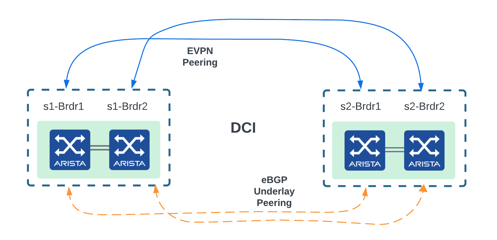
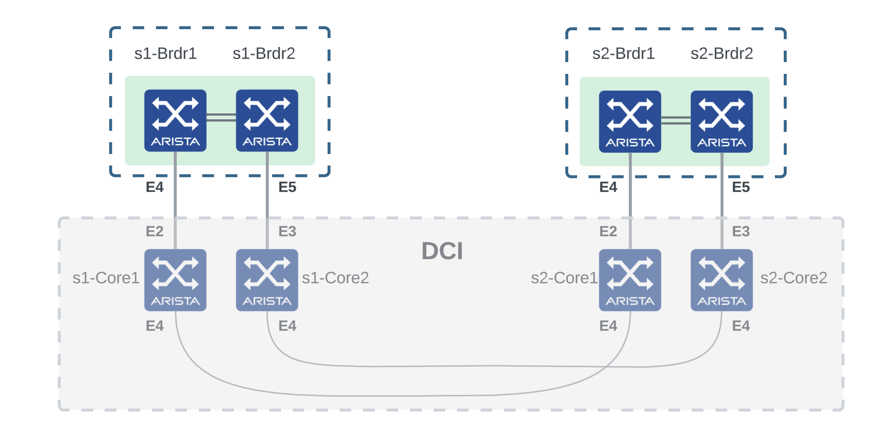
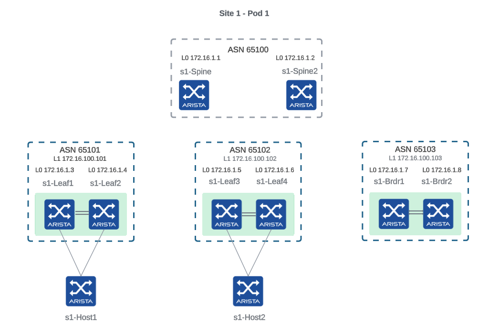
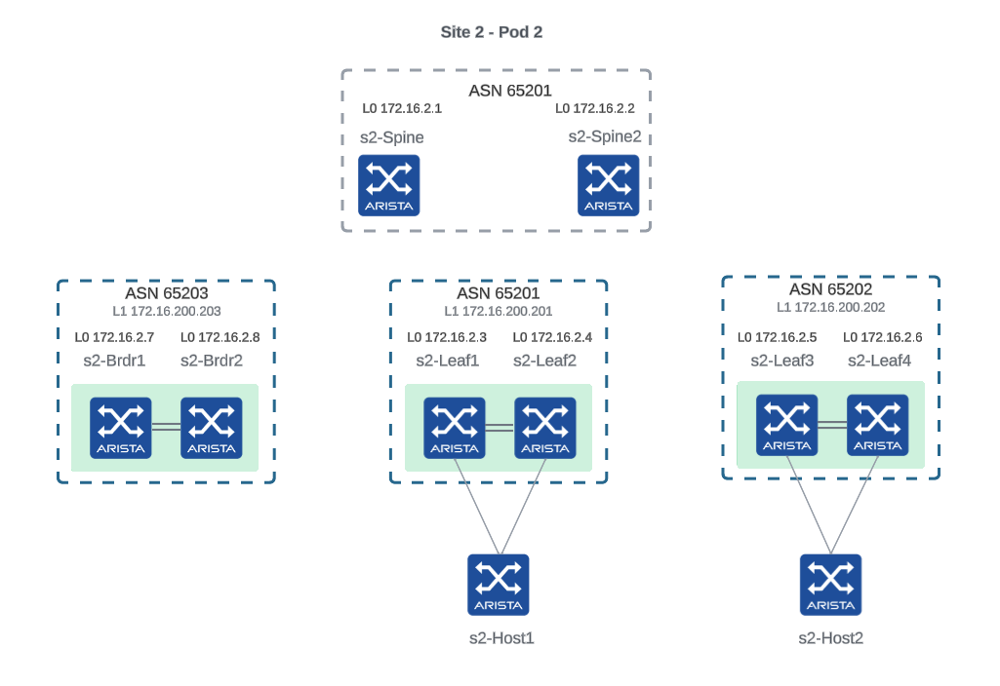

# Lab 2: Create 2 VXLAN-EVPN pods

> In this lab and the following ones, we will use CloudVision **`Studios`** feature to create the fabric configuration by generating configlets for spines and leafs devices.
When using CloudVision Studios, all user actions must be done within a **`Workspace`**.

### Description

When using CloudVision Studios, devices needs to be registered. Also, some studios (like the `L3 Leaf-Spine Fabric` studio) are using device topology information which is streamed by the devices and based on LLDP neighboring. To achieve this, we will be using the `Inventory and Topology` studio as a set-up step.

In this lab, we will configure 2 distinct VXLAN-EVPN pods using the `L3 Leaf-Spine Fabric` studio. We will consider these pods to be in the same fabric split over 2 sites (see diagram). At the end of this lab, `POD1` and `POD2` will be 2 separate EVPN domains: all leaf can only reach the `Loopback0` of other leaves of their respective pods.

<p align="center">

</p>

### Instructions

#### Define the Studios inventory and topology

1. Go to `Provisioning` menu and access the `Studios` tab. Click on the `Create Workspace` button to create a workspace and give it a meaningful name like `Add POD1 and POD2 devices to Studios`.
2. Click on the `Inventory and Topology` studio, go to the `Network Updates` tab and select the updates for all the devices except for `s1-core1`, `s1-core2`, `s2-core1`, `s2-core2`, `s1-host1`, `s1-host2`, `s2-host1` and `s2-host2` that will not be managed by Studios. Click on `Accept Updates`.
3. Since we consider that `s1-brdr1` is directly connected to `s2-brdr1` and `s1-brdr2` is directly connected to `s2-brdr2`, we need to go reflect this in the topology. Go to the `Registered Devices` tab and click on `View` under the `Interfaces` column for the device `s1-brdr1`. Remove the `Ethernet5` interface and modify the neighbor of `Ethernet4` to be `s2-brdr1` with interface `Ethernet4`.
4. Repeat step 3 for devices `s1-brdr2`, `s2-brdr1` and `s2-brdr2`. Refer to the diagram to get the interfaces to be removed and the ones to be modified for each device.

<p align="center">

</p>

5. Click on the `Review Workspace` button on the top right corner and click on `Submit Workspace` on the next screen.
6. Studios is now ready to provision `POD1` and `POD2` devices.

#### Provision the pods

1. Go to `Provisioning` menu and access the `Studios` tab. Click on the `Create Workspace` button to create a workspace and give it a meaningful name like `Create POD1 and POD2 configuration`.
2. Click on the `L3 Leaf-Spine Fabric` studio, add a datacenter called `Datacenter1`, go to the datacenter configuration by clicking on the arrow and assign all the devices to this datacenter using the `Assigned Devices` field on at the top of the screen. Scroll all the way down the list to add all devices.
3. Scroll to the `Role` table and fill the table with the following values:
   - `s1-spine1` and `s2-spine1` will have the role `Spine` and the `NodeId` 1.
   - Similarly, `s1-spine2` and `s2-spine2` will have the role `Spine` and the `NodeId` 2.
   - All other devices will have the role `Leaf`.
   - Devices with names ending with `leafN` will have the `NodeId` N.
   - `s1-brdr1` and `s2-brdr1` will have the `NodeId` 5.
   - `s1-brdr2` and `s2-brdr2` will have the `NodeId` 6.
4. Go to the `Pods` table at the top of the page and add 2 pods named `POD1` and `POD2`.

<p align="center">

</p>

5. Go to `POD1` configuration and assign all devices with names starting with `s1`. Spines should now be visible in the `Spines` table.
6. Create the following `L3 Leaf Domains` (leave all default values):
   - Create `Leaf-Domain: 101` and assign devices `s1-leaf1` and `s1-leaf2`.
   - Create `Leaf-Domain: 102` and assign devices `s1-leaf3` and `s1-leaf4`.
   - Create `Leaf-Domain: 103` and assign devices `s1-brdr1` and `s1-brdr2`.
7. Under the `POD1` configuration, modify the following configuration:
   - `MLAG Peer Link Subnet` must have the value `169.254.0.0/31`
   - `Leaf Transit Uplink IPv4 Pool` must have the value `10.0.0.0/24`
   - `VTEP Address Range` must have the value `172.16.100.0/24`
   - `Spine ASN` must have the value `65100`.
   - `Spine Router ID Subnet` must have the value `172.16.1.0/24`.
   - `Leaf Router ID Subnet` must have the value `172.16.1.0/24`.
8. Go to `POD2` configuration and assign all devices with names starting with `s2`. Spines should now be visible in the `Spines` table.

<p align="center">

</p>

9.  Create the following `L3 Leaf Domains` (leave all default values):
   - Create `Leaf-Domain: 201` and assign devices `s2-leaf1` and `s2-leaf2`.
   - Create `Leaf-Domain: 202` and assign devices `s2-leaf3` and `s2-leaf4`.
   - Create `Leaf-Domain: 203` and assign devices `s2-brdr1` and `s2-brdr2`.
10. Under the `POD2` configuration, modify the following configuration:
   - `MLAG Peer Link Subnet` must have value `169.254.0.0/31`
   - `Leaf Transit Uplink IPv4 Pool` must have value `10.0.0.0/24`
   - `VTEP Address Range` must have value `172.16.200.0/24`
   - `Spine ASN` must have value `65200`.
   - `Spine Router ID Subnet` must have value `172.16.2.0/24`.
   - `Leaf Router ID Subnet` must have value `172.16.2.0/24`.
11. Click on the `Review Workspace` button on the top right corner. You will be taken to the `Workspace` screen where the inputs will be validated, the configlets generated and the configuration validated by the devices.
12. Review the configuration changes for each device and click on `Submit Workspace` then `View Change Control`.
13. You will be taken to the `Change Control` tab in the newly created change control. Review, Approve and Execute the change control.
14. `POD1` and `POD2` devices are now configured as independant EVPN domains.
15. Connect to a spine and check the underlay and EVPN bgp sessions.

On `POD1`:

```cli
s1-spine1#show ip bgp summary
BGP summary information for VRF default
Router identifier 172.16.1.1, local AS number 65100
Neighbor Status Codes: m - Under maintenance
  Description              Neighbor  V AS           MsgRcvd   MsgSent  InQ OutQ  Up/Down State   PfxRcd PfxAcc
  s1-leaf1_Ethernet2       10.0.0.1  4 65101             10        11    0    0 00:01:25 Estab   3      3
  s1-leaf2_Ethernet2       10.0.0.5  4 65101             13        11    0    0 00:01:25 Estab   3      3
  s1-leaf3_Ethernet2       10.0.0.9  4 65102              9        12    0    0 00:01:25 Estab   3      3
  s1-leaf4_Ethernet2       10.0.0.13 4 65102             10        11    0    0 00:01:24 Estab   3      3
  s1-brdr1_Ethernet2       10.0.0.17 4 65103             10        11    0    0 00:01:24 Estab   3      3
  s1-brdr2_Ethernet2       10.0.0.21 4 65103             10        11    0    0 00:01:24 Estab   3      3
s1-spine1#show bgp evpn summary
BGP summary information for VRF default
Router identifier 172.16.1.1, local AS number 65100
Neighbor Status Codes: m - Under maintenance
  Description              Neighbor   V AS           MsgRcvd   MsgSent  InQ OutQ  Up/Down State   PfxRcd PfxAcc
  s1-leaf1                 172.16.0.1 4 65101              5         5    0    0 00:01:29 Estab   0      0
  s1-leaf2                 172.16.0.2 4 65101              5         5    0    0 00:01:29 Estab   0      0
  s1-leaf3                 172.16.0.3 4 65102              5         5    0    0 00:01:30 Estab   0      0
  s1-leaf4                 172.16.0.4 4 65102              5         5    0    0 00:01:25 Estab   0      0
  s1-brdr1                 172.16.0.5 4 65103              5         5    0    0 00:01:29 Estab   0      0
  s1-brdr2                 172.16.0.6 4 65103              5         5    0    0 00:01:29 Estab   0      0
s1-spine1#
```

On `POD1`:

```cli
s2-spine1#show ip bgp summary
BGP summary information for VRF default
Router identifier 172.16.2.1, local AS number 65200
Neighbor Status Codes: m - Under maintenance
  Description              Neighbor  V AS           MsgRcvd   MsgSent  InQ OutQ  Up/Down State   PfxRcd PfxAcc
  s2-leaf1_Ethernet2       10.0.0.1  4 65201             12        16    0    0 00:05:21 Estab   3      3
  s2-leaf2_Ethernet2       10.0.0.5  4 65201             15        15    0    0 00:05:21 Estab   3      3
  s2-leaf3_Ethernet2       10.0.0.9  4 65202             13        15    0    0 00:05:20 Estab   3      3
  s2-leaf4_Ethernet2       10.0.0.13 4 65202             12        16    0    0 00:05:20 Estab   3      3
  s2-brdr1_Ethernet2       10.0.0.17 4 65203             14        16    0    0 00:05:21 Estab   3      3
  s2-brdr2_Ethernet2       10.0.0.21 4 65203             14        16    0    0 00:05:20 Estab   3      3
s2-spine1#show bgp evpn summary
BGP summary information for VRF default
Router identifier 172.16.2.1, local AS number 65200
Neighbor Status Codes: m - Under maintenance
  Description              Neighbor   V AS           MsgRcvd   MsgSent  InQ OutQ  Up/Down State   PfxRcd PfxAcc
  s2-leaf1                 172.16.0.1 4 65201             10        10    0    0 00:05:28 Estab   0      0
  s2-leaf2                 172.16.0.2 4 65201             10        10    0    0 00:05:27 Estab   0      0
  s2-leaf3                 172.16.0.3 4 65202             11        11    0    0 00:05:27 Estab   0      0
  s2-leaf4                 172.16.0.4 4 65202             11        11    0    0 00:05:27 Estab   0      0
  s2-brdr1                 172.16.0.5 4 65203             10        10    0    0 00:05:26 Estab   0      0
  s2-brdr2                 172.16.0.6 4 65203             10        10    0    0 00:05:27 Estab   0      0
s2-spine1#
```
